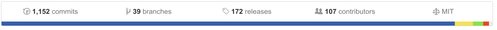
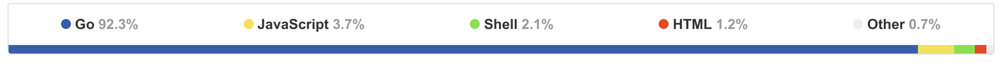

# TRæfIk

#VSLIDE
## What?

Træfɪk is a modern HTTP reverse proxy and load balancer made to deploy microservices with ease

#VSLIDE

## Why?

* Fast!
* HTTP/2 support <!-- .element: class="fragment" -->
* Websocket support <!-- .element: class="fragment" -->
* SSL + Let’s Encrypt <!-- .element: class="fragment" -->
* Backends: Docker, Swarm, Kubernetes, Consul, Etcd, etc. <!-- .element: class="fragment" -->
* Hot-reloading of configuration <!-- .element: class="fragment" -->
* Circuit breakers ; Retry on fail; Graceful shutdown of http connections <!-- .element: class="fragment" -->
* <!-- .element: class="fragment" -->And more! [https://traefik.io/#features](https://traefik.io/#features)

#VSLIDE

## Overview

#HSLIDE
# Configuration

Træfɪk can be configured using many configuration sources with the following precedence order. Each item takes precedence over the item below it

* Key-value Store   
* Arguments
* Configuration file
* Default

#VSLIDE

# Static

The static configuration is the global configuration which is setting up connections to configuration backends and entrypoints.

* [traefik.sample.toml](https://raw.githubusercontent.com/containous/traefik/master/traefik.sample.toml)
* [commented doc](http://coment.me/90BkmY2)

#VSLIDE

# Dynamic

Both static global configuration and dynamic configuration can be sorted in a Key-value store.

This section explains how to launch Træfɪk using a configuration loaded from a Key-value store.

Træfɪk supports several Key-value stores:

* Consul
* etcd
* ZooKeeper
* boltdb

Link: [commented doc](http://coment.me/qpMZvcR)

#HSLIDE

## Demo?

#HSLIDE
## links

* Documentation [https://docs.traefik.io]()
* Star Træfɪk On Github [https://github.com/containous/traefik]()
* Support [https://traefik.slack.com]()
* [https://github.com/containous/traefik/examples](https://github.com/containous/traefik/tree/master/examples)

#HSLIDE

**Questions?**

<iframe frameborder="0" scrolling="no" marginheight="0" marginwidth="0" width="650" height="500" src="https://www.radarbox24.com/?widget=1&z=10&lat=48.85538675402645&lng=2.350493044767501"></iframe>