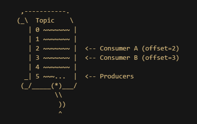
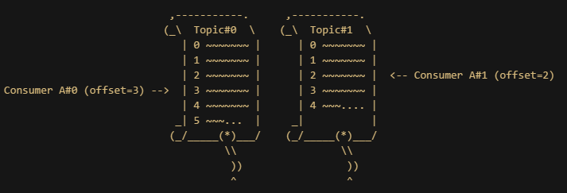
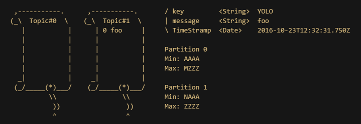
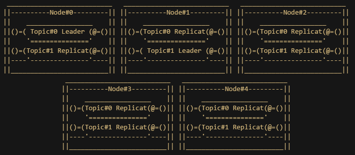

# Kafka : distributed streaming platform
#HSLIDE
## Unix Philosophy

- Make each program do **one thing well**
- Expect the output of every program to become the input to another, **as yet unknown** programl.

#VSLIDE
### PIPE
```
awk | sort | uniq
```

#VSLIDE
### Input / output redirection
```
awk | sort > file
```

#VSLIDE
### Extensibility by composition

``` 
access.log
|-> awk
    |-> sort
        |-> uniq
            |-> ip-geolocate
                |-> sort
                    |-> gnuplot
```

#VSLIDE
### The simplest possible interface

- ordered sequence of bytes
- finite or infinite
- often ASCII

#VSLIDE
### In the 21st century

#### Good
- Composability
- Streams
- Simple, powerful interface

#### Problems
- Single machine only
- One-to-one communication only
- No fault tolerance

#VSLIDE
### Message broker


#VSLIDE
#### Problems
- Single machine only
  - Distributed processing
- One-to-one communication only
  - Pub/sub pattern
- No fault tolerance
  - Replication, auto-recovery

#VSLIDE


#HSLIDE
# Kafka : distributed streaming platform
#VSLIDE
## Capabilities

- publish & subscribe to streams of records
- store streams of records in a fault-tolerant way
- process streams of records as they occur

#VSLIDE
## Use case

- real-time streaming data pipelines between applications
- real-time streaming applications that transform or react to the the streams data

> <3 Event sourcing <3

#VSLIDE


#HSLIDE
## Topics



#VSLIDE
## Topics
- a topic is a category name to which records are published.
- a topic can have zero, one or many producers / consumers.
- each partition is an ordered, immutable sequence of record.
- retains all published records (whether or not they have been consumed)

#VSLIDE
## Partitions



- each partition can have zero or one consumer by consumer's group.
- the **offset** is a sequential id number that uniquely identifies each record within the partition.

#VSLIDE
## Records

- Key : partition's Key
- Message : string (XML, JSON, Avro...)
- TimeStramp



#HSLIDE
## Failover : Replicat



- Replicat factor = 5

#VSLIDE
## Failover : Consensus algorithm


- PacificA from Microsof

#VSLIDE
## Failover : Consumer registration algorithm


#VSLIDE
### Add a new partition


#VSLIDE
### Add a new consumer


#VSLIDE
### Remove a consumer


