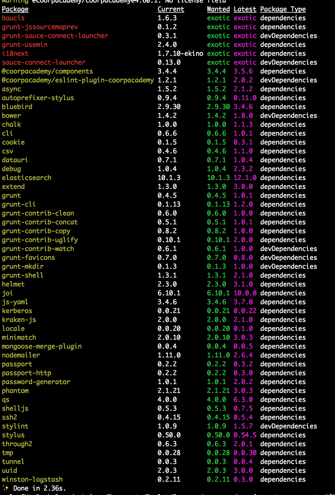

# Yarn

__Fast__

__Reliable__

__Secure__

#VSLIDE

## WHo?

Facebook but also Google, Tile & Exposent

## Why?

Npm caveats:
* not reliable
* not always the same resolution path
* shrinkwrap not by default
* can't be offline

#VSLIDE

##How?

Yarn resolves these issues around versioning and non-determinism by using lockfiles and an install algorithm that is **deterministic** and **reliable**.

#VSLIDE

## Workflow

3steps:

#VSLIDE

## Workflow

1/3

__Resolution__: Resolve dependencies by making requests to the registry and recursively looking up each dependency.

#VSLIDE

## Workflow

2/3

__Fetching__: Looks in a global cache directory t. If it's missing, Yarn fetches the tarball for the package and places it in the global cache. Support source control full offline installs.

#VSLIDE

## Workflow

3/3

__Linking__: Finally, Links everything together by copying to the local node_modules folder.

#HSLIDE

__Installation__

Standalone binary

*MacOsX*

```
brew update
brew install yarn
```

*Linux*

* Debian/Ubuntu Linux
* CentOS / Fedora / RHEL
* Arch Linux
* Solus


#HSLIDE

First try

```
/usr/local/Cellar/yarn/0.17.3/libexec/lib/node_modules/yarn/bin/yarn.js:47
      throw err;
      ^
Error: ENOENT: no such file or directory, open '/Users/calvy/Library/Caches/Yarn/.roadrunner.json'
    at Error (native)
    at Object.fs.openSync (fs.js:640:18)
    at Object.fs.writeFileSync (fs.js:1333:33)
    at /usr/local/Cellar/yarn/0.17.3/libexec/lib/node_modules/yarn/node_modules/roadrunner/index.js:25:6
```

#VSLIDE

https://github.com/yarnpkg/yarn/issues/1724

```
mkdir -p ~/Library/Caches/Yarn
```

=====>

```
yarn --version
0.17.3
```

#HSLIDE

Side effect of brew instal yarn

* not os consistent
* must change the path 
`export PATH="$PATH:$HOME/.yarn/bin"`
* brew install node and break nvm

#VSLIDE

wait really instal like that?

consider using npm

```
npm i -g yarn 
```

```
yarn --version
0.17.4
```


#VSLIDE

Ok let's go `yarn`

```
info No lockfile found.
error npm-shrinkwrap.json found. This will not be updated or respected. See https://yarnpkg.com/en/docs/migrating-from-npm for more information.
warning @coorpacademy/coorpacademy@4.60.1: No license field
[1/4] 🔍  Resolving packages...
error An unexpected error occurred: "https://registry.yarnpkg.com/@coorpacademy%2fcoorpacademy-core: User not found".
info If you think this is a bug, please open a bug report with the information provided in "/Users/calvy/Documents/Boulot/Sources/coorpacademy/yarn-error.log".
info Visit https://yarnpkg.com/en/docs/cli/install for documentation about this command.
```

#VSLIDE

WHAT?

```
_auth="xxxxxx="
email=lc@coorpacademy.com
//registry.npmjs.org/:_authToken=xxxxxxxxxx
@coorpacademy:registry=http://registry.npmjs.org/
```

Let's retry `yarn`

#VSLIDE

```
info No lockfile found.
error npm-shrinkwrap.json found. This will not be updated or respected. See https://yarnpkg.com/en/docs/migrating-from-npm for more information.
warning @coorpacademy/coorpacademy@4.60.1: No license field
[1/4] 🔍  Resolving packages...
.....
warning grunt-favicons > cheerio > cheerio-select > CSSselect > CSSwhat@0.4.7: the module is now available as 'css-what'
[2/4] 🚚  Fetching packages...
error An unexpected error occurred: "https://registry.yarnpkg.com/@coorpacademy/squirrel/-/squirrel-2.3.0.tgz: invalid tar file".
```

`yarn config set registry https://registry.npmjs.org/`

```
# THIS IS AN AUTOGENERATED FILE. DO NOT EDIT THIS FILE DIRECTLY.
# yarn lockfile v1

registry "https://registry.npmjs.org/"
email system@coorpacademy.com
username coorpadmin
```

Let's retry `yarn`

===> Good

#HSLIDE

run `./core/bin/web`

```
  battleMapper function
    1) "before all" hook
Bugsnag:  Bugsnag: error notifying bugsnag.com - Error: Current release stage not permitted to send events to Bugsnag.
Bugsnag:  Error: Could not locate the bindings file. Tried:
 → /Users/calvy/Documents/Boulot/Sources/coorpacademy/node_modules/bcrypt/build/bcrypt_lib.node
 lib.node
 → /Users/calvy/Documents/Boulot/Sources/coorpacademy/node_modules/bcrypt/compiled/6.5.0/darwin/x64/bcrypt_lib.node
    at bindings (node_modules/bindings/bindings.js:88:9)
    at Object.<anonymous> (node_modules/bcrypt/bcrypt.js:3:35)
    at require (internal/module.js:20:19)
    at Object.<anonymous> (core/models/user.js:8:16)
    at require (internal/module.js:20:19)
    at loadSchema (core/models/index.js:42:24)
    at apply (node_modules/lodash/lodash.js:499:17)
    at wrapper (node_modules/lodash/lodash.js:5383:16)
    at Array.reduce (native)
    at createConnection (core/models/index.js:38:17)
    at db (test/server/context.js:28:26)
    at apply (node_modules/lodash/lodash.js:497:27)
    at wrapper (node_modules/lodash/lodash.js:5383:16)
    at node_modules/async/lib/async.js:718:13
    at Immediate.iterate (node_modules/async/lib/async.js:262:13)


```

????

`npm rebuild`

#VSLIDE

`npm i -g yarn@latest`

===> Good

## __Yarn is not well tested!__

#HSLIDE

## Advices

To make sure your app works consistently, you should always save the yarn.lock file in your code repository.

#VSLIDE

## Caveats

Don't use npm-shrinkwrap.json on first yarn.lock

#VSLIDE

__Don't work in --production mode__

```
Error: Cannot find module 'semver'
    at Function.Module._resolveFilename (module.js:455:15)
    at Function.Module._load (module.js:403:25)
    at Function._load (/Users/calvy/Documents/Boulot/Sources/coorpacademy/node_modules/pmx/lib/transaction.js:62:21)
```

#VSLIDE

`yarn why semver`

```
yarn why v0.17.6
[1/4] 🤔  Why do we have the module "semver"...?
[2/4] 🚚  Initialising dependency graph...
warning @coorpacademy/coorpacademy@4.61.0: No license field
[3/4] 🔍  Finding dependency...
[4/4] 🚡  Calculating file sizes...
info This module exists because "bower" depends on it.
info Disk size without dependencies: "208kB"
info Disk size with unique dependencies: "208kB"
info Disk size with transitive dependencies: "208kB"
info Amount of shared dependencies: 0
✨  Done in 2.20s.
```

#VSLIDE

## Workaround

```$ jq 'del(.devDependencies)' package.json > tmp.json && mv tmp.json package.json```

#HSLIDE

## Cool things

Always lock dependencies

Add ```yarn add baucis```

Remove ```yarn remove baucis```

Simple lock structure to avoid git merge collision

#VSLIDE

```yaml
# THIS IS AN AUTOGENERATED FILE. DO NOT EDIT THIS FILE DIRECTLY.
# yarn lockfile v1


"@coorpacademy/components-bundler@^3.1.0":
  version "3.5.0"
  resolved "https://registry.npmjs.org/@coorpacademy/components-bundler/-/components-bundler-3.5.0.tgz#490d8f54de3456cc1ba98903dcc2ce408f116425"
  dependencies:
    babel-cli "^6.11.4"
     extract-text-webpack-plugin "^2.0.0-beta.3"
    minimist "^1.2.0"
    postcss-loader "^1.1.1"
    style-loader "^0.13.0"
    webpack "^2.1.0-beta.25"

"@coorpacademy/components@^3.4.4":
  version "3.5.6"
  resolved "https://registry.npmjs.org/@coorpacademy/components/-/components-3.5.6.tgz#25571b4c3e4d55be4679fe27cc0b64dd65d4472a"
  dependencies:
    "@coorpacademy/treantjs-core" "^3.5.0"
    api-check "^7.5.5"
    file-loader "^0.9.0"
    hyperx "^2.0.4"
    lodash "^4.14.1"
```

#VSLIDE

No support on heroku.
Fix possible with *heroku-prebuilt* hook

#VSLIDE

`yarn outdated`



#VSLIDE

##Perf

```
time npm i ===> real  4m22.777s
time yarn  ===> real   1m0.048s
```

#HSLIDE

Conclusion 

# **GO FOR IT NOW!**

https://github.com/CoorpAcademy/coorpacademy/pull/9610

