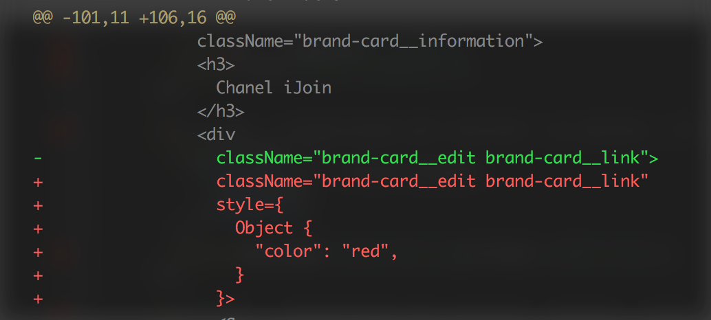
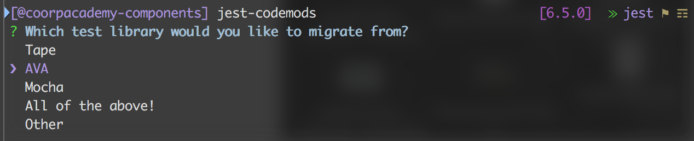
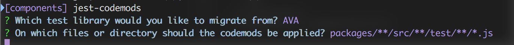
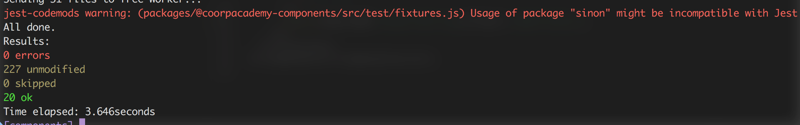
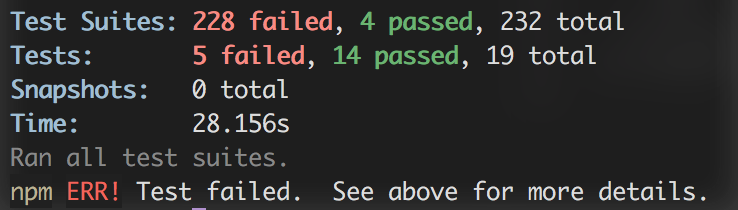
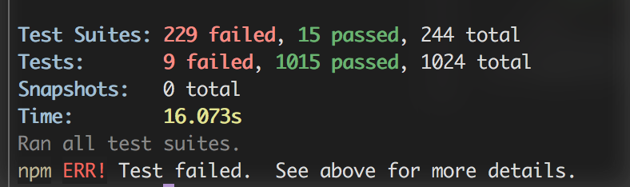
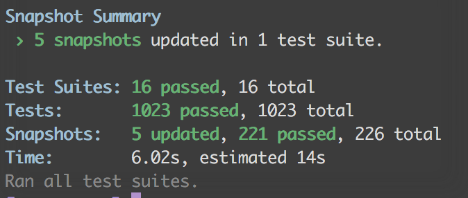
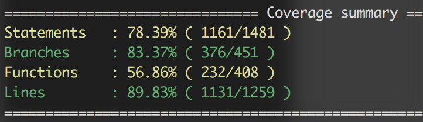
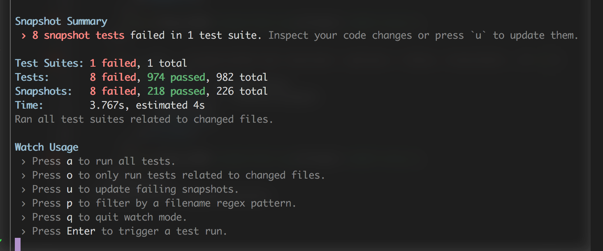

#HSLIDE
##Testing React components
- components v4 --> React <!-- .element: class="fragment" -->

#VSLIDE
UT today: we render the whole Component
```
test(`${it} › instanciated and resolved | no options`, t => {
  const vTree = (
    <Component {...fixture.props}>
      {children}
    </Component>
  );
  t.truthy(ReactDOM.renderToString(vTree));
});
```

#VSLIDE
- FB tools -> [Enter: TestUtils!](http://farisj.github.io/2016/01/02/testing-react-components-with-shallow-rendering.html)
- shallow rendering <!-- .element: class="fragment" -->
- This tool allows us to inspect only the rendered output of that component itself, leaving all React subcomponents as unrendered.  <!-- .element: class="fragment" -->
- In this way, we only need to check that the correct props are passed to subcomponents, and don’t need to worry about their inner details here <!-- .element: class="fragment" -->

#VSLIDE
- reading TestUtils documentation...
- Facebook recommends Enzyme by Airbnb <!-- .element: class="fragment" -->
- provides tools to manipulate/traverse React output <!-- .element: class="fragment" -->
- [Example](http://airbnb.io/enzyme/docs/api/shallow.html#shallow-rendering-api]) <!-- .element: class="fragment" -->

#VSLIDE
#### Enzyme

- [find()](https://github.com/airbnb/enzyme/blob/master/docs/api/selector.md)
- any test runner <!-- .element: class="fragment" -->
- example with [AVA](https://github.com/airbnb/enzyme/blob/master/docs/guides/tape-ava.md#ava) <!-- .element: class="fragment" -->

#VSLIDE
#### wait a minute...

- Facebook maintains Jest
- [Kent C. Dodds](https://medium.com/@kentcdodds/migrating-to-jest-881f75366e7e#.gw98x58g8) <!-- .element: class="fragment" -->
- Grommet <!-- .element: class="fragment" -->
  - React components library<!-- .element: class="fragment" -->
  - Manual DOM testing  -> shallow rendering <!-- .element: class="fragment" -->
  - No DOM ==> no React life

#VSLIDE
- if anything changes in the snapshot, the test fails.
- It's up to the developer to inspect the snapshot and decide whether is an expected change or if it is a bug in their code. <!-- .element: class="fragment" -->

#VSLIDE
- Easier inspection: the snapshot content is the actual DOM structure.
- We find it extremely convenient as we can check how our component will render in the browser. <!-- .element: class="fragment" -->
- We can validate the attached events and make sure the DOM structure is as lean as possible. <!-- .element: class="fragment" -->

#VSLIDE
##snaphosts
<!-- .element: class="fragment" -->

#HSLIDE
## Jest


### JS test runner
maintained by Facebook <!-- .element: class="fragment" -->

#HSLIDE
### Global picture

- Performance (parallel processes)<!-- .element: class="fragment" -->
- Mocking <!-- .element: class="fragment" -->
- Snapshot testing <!-- .element: class="fragment" -->
- Code coverage <!-- .element: class="fragment" -->

#HSLIDE
### migrating from AVA

#VSLIDE
### jest-codemod
Codemods that simplify migrating JavaScript test files from Mocha, Tape and AVA to Jest.

#VSLIDE
```
> npm install -g jest-codemods
> jest-codemods
```

#VSLIDE
simple prompts
 <!-- .element: class="fragment" -->

 <!-- .element: class="fragment" -->

#VSLIDE


<!-- .element: class="fragment" -->

#VSLIDE
### manual migration
jest config in package.json

#VSLIDE
```
"testRegex": "/packages(/.*)?/src(/.*)?/test(?!/fixtures)(/.*)?/*.js$"
```

 <!-- .element: class="fragment" -->

#VSLIDE
- keywords `it, expect`

 <!-- .element: class="fragment" -->

#VSLIDE
##coverage --> Istanbul
"easy" copy from `nyc` settings
``
"coverageDirectory": "coverage",
    "coverageReporters": [
      "lcov",
      "text-summary"
    ],
    "collectCoverage": true,
    "collectCoverageFrom": [
      "packages/**/src/**/*.js",
      "!**/test/**",
      "!**/node_modules/**"
    ],
    "coveragePathIgnorePatterns": [
      "/packages(/.*)?/src(/.*)?/test(/.*)?$",
      "/packages(/.*)?/dist(/.*)?$",
      "/packages(/.*)?/es(/.*)?$",
      "/packages(/.*)?/lib(/.*)?$"
    ]
```

#VSLIDE


#VSLIDE
silent watch


#HSLIDE
##Next for @Coorponents
- AVA vs Jest <!-- .element: class="fragment" -->
-  <!-- .element: class="fragment" -->
- to snapshot or not to snapshot ? <!-- .element: class="fragment" -->
- shallow rendering <!-- .element: class="fragment" -->

#HSLIDE
##sources

- Testing React with [Jest](https://auth0.com/blog/testing-react-applications-with-jest/?utm_source=echojs&utm_medium=sc&utm_campaign=testing_react_jest)

- [Grommet](https://blog.grommet.io/post/2016/09/01/how-we-landed-on-jest-snapshot-testing-for-javascript) uses Jest snapshots

- [Enzyme](https://medium.com/airbnb-engineering/enzyme-javascript-testing-utilities-for-react-a417e5e5090f#.e8xj686ds)

- Testing React components with [Jest + Enzyme](https://hackernoon.com/testing-react-components-with-jest-and-enzyme-41d592c174f#.q489aotk8)

