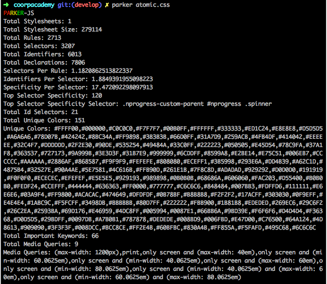
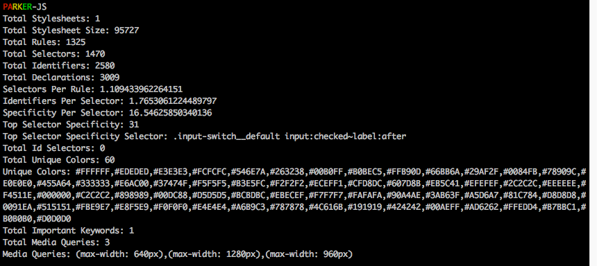

# Parker CSS && PostCSS
### Uses and Applications

#HSLIDE
### What is Parker CSS?

Static Analysis tool for CSS files
npm install -g parker

#HSLIDE
### Run on compilated CSS
//
parker path/mystyle.css

#HSLIDE
### What is PostCSS?

- xxx
- xxx
- xxx