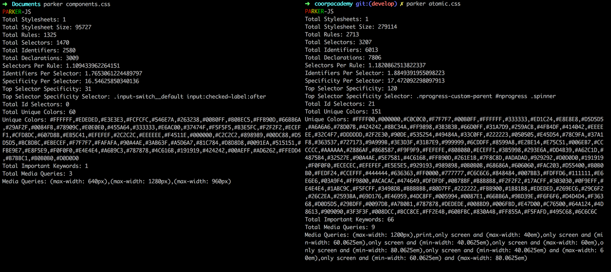
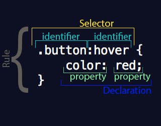

# Parker CSS && PostCSS
### Uses and Applications

#HSLIDE
### What is Parker CSS?

Static Analysis tool for CSS files

npm install -g parker

#HSLIDE
### Run on compilated CSS
```js
parker path/mystyle.css
```


#HSLIDE
### WHAT ?


- Total stylsheets
- Total size
- Total rules
- Total selectors
- ...

#HSLIDE

### How to use metrics ?

Selectors / Rules 

components.css
```
Total Stylesheet Size : 95727
```

atomic.css
```
Total Stylesheet Size: 279114
```

#HSLIDE

###Selectors / Rule

components.css
```
Selectors Per Rule: 1.109433962264151
```

atomic.css
```
Selectors Per Rule: 1.1820862513822337
```

Closest to 1

#HSLIDE

###Identifiers / Selectors

components.css
```
Identifiers Per Selector: 1.7653061224489797
```

atomic.css
```
Identifiers Per Selector: 1.8849391955098223
```

Should be between 1 & 2

#HSLIDE

###Specificity / Selector

components.css
```
Specificity Per Selector: 16.54625850340136
```

atomic.css
```
Specificity Per Selector: 17.472092298097913
```

closest to 10, better it is (don't go over 20)

#HSLIDE

###Specificity / Selector

components.css
```
Top Selector Specificity: 31
Top Selector Specificity Selector: .input-switch__default input:checked~label:after
```

atomic.css
```
Top Selector Specificity: 120
Top Selector Specificity Selector: .nprogress-custom-parent #nprogress .spinner
```

#HSLIDE

###ID Selector

components.css
```
Total Id Selectors: 0
```

atomic.css
```
Total Id Selectors: 21
```

#HSLIDE

###Unique Color

components.css
```
Total Unique Colors: 60
Unique Colors: #FFFFFF,#EDEDED,#E3E3E3,#FCFCFC,#546E7A,#263238,#00B0FF,#B0BEC5,#FFB90D,#66BB6A,#29AF2F,#0084FB,#78909C,#E0E0E0,#455A64,#333333,#E6AC00,#37474F,#F5F5F5,#B3E5FC,#F2F2F2,#ECEFF1,#CFD8DC,#607D8B,#EB5C41,#EFEFEF,#2C2C2C,#EEEEEE,#F4511E,#000000,#C2C2C2,#898989,#00DC88,#D5D5D5,#BCBDBC,#EBECEF,#F7F7F7,#FAFAFA,#90A4AE,#3AB63F,#A5D6A7,#81C784,#D8D8D8,#0091EA,#515151,#FBE9E7,#E8F5E9,#F0F0F0,#E4E4E4,#A6B9C3,#787878,#4C616B,#191919,#424242,#00AEFF,#AD6262,#FFEDD4,#B7BBC1,#B0B0B0,#D0D0D0
```

atomic.css
```
Total Unique Colors: 151
Unique Colors: #FFFF00,#000000,#C0C0C0,#F7F7F7,#00B0FF,#FFFFFF,#333333,#ED1C24,#E8E8E8,#D5D5D5,#A6A6A6,#78D07B,#424242,#8BC34A,#FF9898,#3B3B3B,#66D0FF,#31A7D9,#259ACB,#4FB4DF,#414042,#EEEEEE,#32C4F7,#DDDDDD,#2F2E30,#90DE,#535254,#49484A,#33C0FF,#222223,#050505,#E45D54,#78C9FA,#37A1F8,#363537,#727173,#9A999B,#3E3D3F,#31B7E9,#999999,#6CDDFF,#8599A8,#E2BE14,#E75C51,#006EB7,#CCCCCC,#AAAAAA,#2886AF,#868587,#F9F9F9,#FEFEFE,#808080,#ECEFF1,#3B5998,#293E6A,#DD4B39,#A62C1D,#4875B4,#32527E,#90A4AE,#5E7581,#4C616B,#FFB90D,#261E1B,#7F8C8D,#ADADAD,#929292,#D0D0D0,#191919,#F0F0F0,#ECECEC,#EFEFEF,#E5E5E5,#929193,#989898,#0B0B0B,#68686A,#606060,#FAC203,#D55400,#B0B0B0,#FEDF24,#CCEFFF,#444444,#636363,#FF0000,#777777,#C6C6C6,#848484,#007BB3,#FDFFD6,#111111,#E6E6E6,#03A9F4,#FF9800,#ACACAC,#474649,#DFDFDF,#0B78BF,#B8B8B8,#F2F2F2,#17ACFF,#303030,#0F9EFF,#E4E4E4,#1ABC9C,#F5FCFF,#3498DB,#BBBBBB,#80D7FF,#222222,#FBB900,#1B81B8,#EDEDED,#269EC6,#29C6F2,#26C2EA,#2593BA,#69D176,#E46959,#4DC8FF,#005994,#0087E1,#66BB6A,#9BD39E,#F6F6F6,#D4D4D4,#F36368,#D0D5D5,#29BDFF,#0097DB,#A7B0B1,#787878,#DEDEDE,#008BD9,#006FBD,#E47D00,#C76500,#64A124,#4D8613,#909090,#3F3F3F,#008DCC,#BCC8CE,#FF2E4B,#60BFBC,#830A4B,#FF855A,#F5FAFD,#495C68,#6C6C6C
```

#HSLIDE

###Important keywords

components.css
```
Total Important Keywords: 1
```

atomic.css
```
Total Important Keywords: 66
```

#HSLIDE

###Total Media Queries

components.css
```
Total Media Queries: 3
```

atomic.css
```
Total Media Queries: 9
```

#HSLIDE


Local or Dependency ?

#HSLIDE
### What is PostCSS?

Already used :

- postcss-modules-extract-imports
- postcss-modules-local-by-default
- postcss-modules-scope
- postcss-modules-values


#HSLIDE

###PostCSS Sprites

Browse all the images that are used in your CSS and build a Sprite file

#HSLIDE

###CSS-MQPacker

packing same CSS media query rules into one

#HSLIDE

###StyleLint

obvious =)

#HSLIDE

###PXtoREM

Converts pixel units to rem

#HSLIDE

###CSSNANO

A modular minifier, built on top of the PostCSS ecosystem

#HSLIDE

###Style Guide

generate a style guide automatically

#HSLIDE

###LINKS
- https://github.com/katiefenn/parker
- http://csswizardry.com/2016/06/improving-your-css-with-parker/
- http://coreybruyere.com/css-audit-with-parker/

- https://www.grafikart.fr/tutoriels/html-css/postcss-663
- http://postcss.parts/
