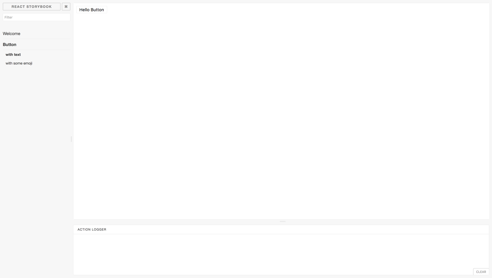

# Once Upon A Time


#HSLIDE
### What? How ? 
### Get! Easy :)


[npm i -g getstorybook](https://raw.githubusercontent.com/coorpacademy/tekacademy/storybook/assets/npmiStorybook.png)

```
cd my-repo
```

[getstorybook](https://raw.githubusercontent.com/coorpacademy/tekacademy/storybook/assets/getStorybook.png)

#VSLIDE

###Use

```
npm run storybook
```



#HSLIDE

### Looks good !

- Easy search
- Every component with every fixtures
- Automatic render
- Action logger

[DEMO](http://localhost:6006/)

#VSLIDE

### What now ?

it's all about stories

1 story === 1 fixtures

#VSLIDE

### Writing a story

One by one

```
// file: src/stories/index.js

import React from 'react';
import { storiesOf, action } from '@kadira/storybook';
import Button from '../components/Button';

storiesOf('Button', module)
  .add('with text', () => (
    <Button onClick={action('clicked')}>Hello Button</Button>
  ))
  .add('with some emoji', () => (
    <Button onClick={action('clicked')}>😀 😎 👍 💯</Button>
  ));
```
#VSLIDE

### Writing a story

load all of them

```
pipe(
  toPairs,
  map(([folderName, _folder]) => ([
    folderName,
    pipe(
      toPairs,
      map(([componentName, factory]) => {
        const _fixtures = get([folderName, componentName], fixtures);
        const stories = storiesOf(`${folderName}.${componentName}`, module);
        pipe(
          toPairs,
          map(([fixtureName, fixture]) => {
            stories.add(fixtureName, () => React.createElement(factory, fixture.props));
          })
        )(_fixtures);
      })
    )(_folder)
  ]))
)(components);
```