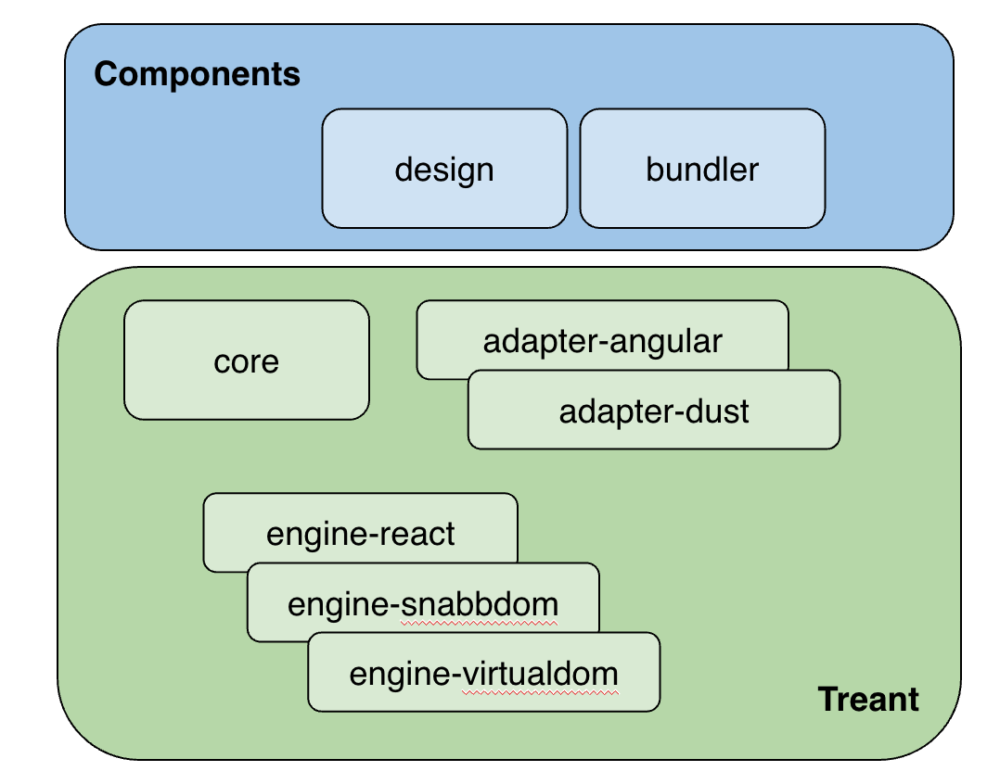
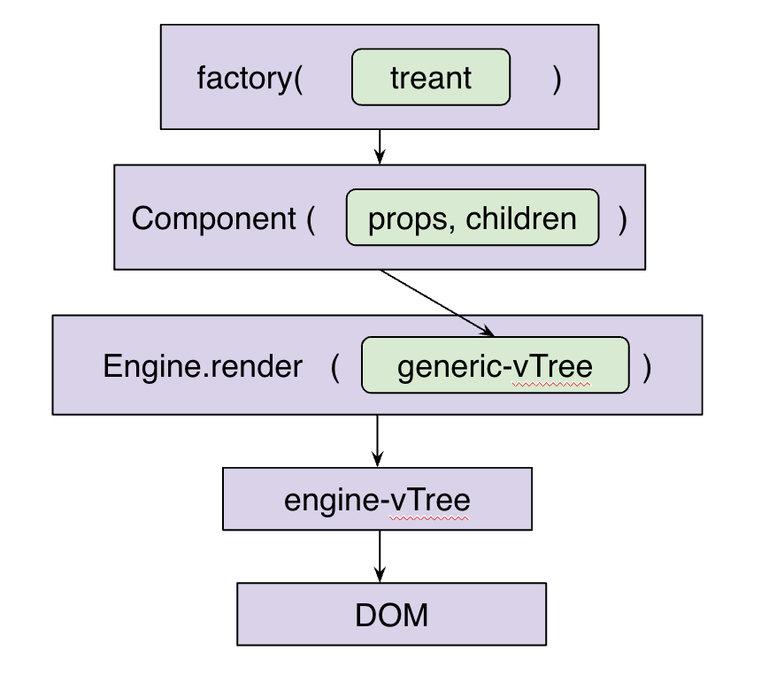

# Components


#HSLIDE
## So, what's all the fuss about?

#VSLIDE
 - View
 - Library

#VSLIDE
 - How it is designed
 - How it is developed
 - How it is used
 - How it works

#VSLIDE
Let's get started
```
npm i
npm start
---> sandbox on http://localhost:3004
```

#HSLIDE
## THE LIBRARY
#### How it is designed

#VSLIDE
### Atomic Design


#VSLIDE
**First things first:** define your *templates*.

#VSLIDE
**Step 2:** hope your UI / UX friends make *consistent* work.

#VSLIDE
**Step 3:** define the interface for every template.
```js
props: {
  type: 'text',
  title: 'Name',
  placeholder: 'Your name',
  value: 'Foo',
  onChange: value => console.log(value)
}
```

#VSLIDE
**Step 4:** split *everything* into atoms, molecules and organisms. Consistency is key.

#HSLIDE
## A TEMPLATE'S GENESIS
#### Analysis

#VSLIDE


#VSLIDE
### How it is developed
```js
const Star = (props, children) => {
  const {
    popular = false
  } = props;
  
  const state = popular ? style.popular : style.default;

  return (
    <span className={state}>★</span>
  );
};
```
```css
.default {
  color: #B0BEC5;
  font-family: 'Open Sans';
  font-weight: 700;
}

.popular {
  composes: default;
  color: #FFB90D;
}
```

#VSLIDE
Do what you're supposed to do.

#VSLIDE
A matter of responsibility…
```js
const GridList = (props, children) => {
  return (
    <div className={style.wrapper}>
      {children}
    </div>
  );
};
```
…and composition
```js
<GridList>
  {brandCards}
</GridList>
```
```js
<div className={style.brand}>
  <BrandCard {...brand}/>
</div>
```

#VSLIDE
## Composition and validation
https://github.com/CoorpAcademy/components/blob/master/packages/%40coorpacademy-components/src/molecule/star-rating/index.js

#VSLIDE
### CSS-modules
- Class composition / dependencies
- Inline style
- Class forwarding to a child via its props
- Media queries
- No global scope, no conflicts
`<div class="brand-card__wrapper___4kKXy">`

#HSLIDE
# USERS' GUIDE
### How it is used

#VSLIDE
### build
- babel
    - /lib es5
    - /es  es6

#VSLIDE
### build
- babel
    - /lib es5
    - /es  es6
- `webpack` ---> `/dist` (css/js)

#VSLIDE
### build
- babel
    - /lib es5
    - /es  es6
- `webpack` ---> `/dist` (css/js)
- bundler --> webpack (mooc/www-static)

#VSLIDE
### mooc
- bundler
- adapter angular --> directives
- https://github.com/CoorpAcademy/coorpacademy/blob/master/app/server/lib/components.js

#VSLIDE
### mooc
```html
<discipline-cards props="props"/>
```
```js
$scope.props = {
    image: 'tree',
    theme: $state.params.theme,
    disciplines: [],
    onDisciplineClick: function(discipline) {
        $rootScope.openDiscipline(discipline);
    },
    onModuleClick: function(module) {
        $rootScope.openModule(module);
    }
};
```

#VSLIDE
### www-static
- bundler
- adapter dust --> helpers
- https://github.com/CoorpAcademy/coorpacademy-www-static/blob/intregating-components/app/components-helpers.js

#VSLIDE
### www-static
```dust
{@coorp-header
    rootUrl="/"
    connexionLink=url.upNotAnonymous
    inscriptionLink=url.upNotAnonymous
/}
```

#VSLIDE
### redux apps
```
import * as treant from '@coorpacademy/treantjs-core';
import {createBrandUpdate} from '@coorpacademy/components';

export default options => {
  const mapStateToProps = createMapStateToProps(CONFIG, options);
  const UpdateBrand = createBrandUpdate(treant, options);

  return pipe(
    mapStateToProps,
    UpdateBrand
  );
};
```
App's renderer picks the engine to render as DOM.

#VSLIDE
### plug
- dev: `npm link`
- dev|test: `npm publish:canary`
- prod: `npm publish:latest`

#HSLIDE
# THE ENGINE
## How it is done

#VSLIDE


#VSLIDE


#HSLIDE
# NEXT
- Sandbox upgrade
 - Edit your props
 - Tags and components lookup
- Pattern lab (see [Lonely Planet's](http://rizzo.lonelyplanet.com/styleguide/design-elements/colours))
- Everything is a component
- **Atomic Design** should be a part of every step


