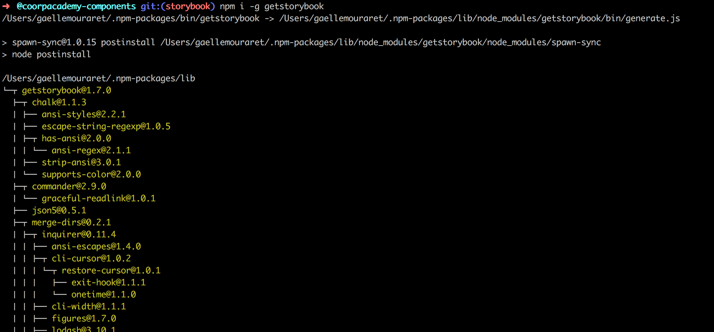
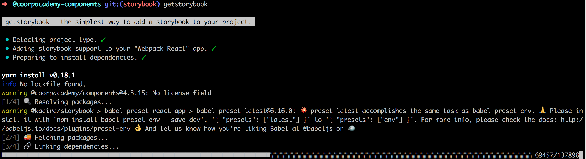
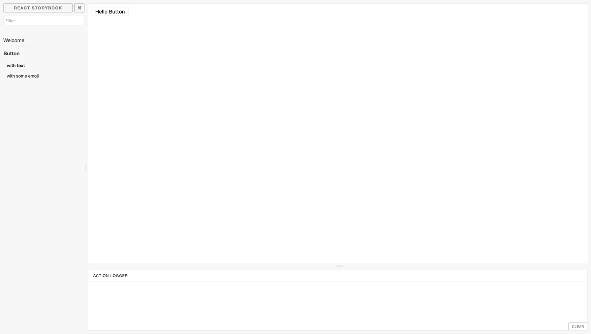
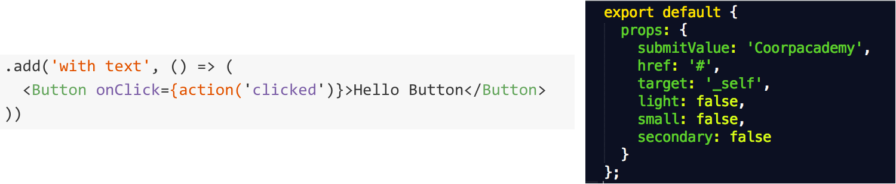
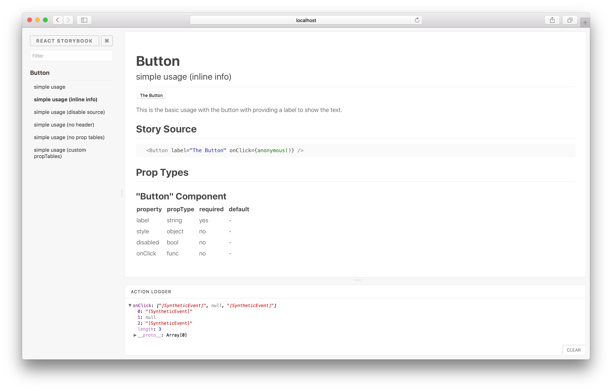

# Once Upon A Time


#VSLIDE

###New tool

First released about 1 year ago

[@kadira/storybook](https://www.npmjs.com/package/@kadira/storybook)


#HSLIDE
### What? How ? 
### Get! Easy :)

```
$ npm i -g getstorybook

$ cd my-repo

$ getstorybook
```

#VSLIDE



#VSLIDE




#VSLIDE

###Use

```
npm run storybook
```



#HSLIDE

### Looks good !

- Easy search
- Every component with every fixtures
- Automatic render (hot reloading)
- Action logger

[LIVE ACTION](http://localhost:3004/)

#VSLIDE

### What now ?

it's all about stories

Stories are substates of the component 
1 story === 1 fixtures



#VSLIDE

### Writing a story

```
// file: src/stories/index.js

import React from 'react';
import { storiesOf, action } from '@kadira/storybook';
import Button from '../components/Button';

storiesOf('Button', module)
  .add('with text', () => (
    <Button onClick={action('clicked')}>Hello Button</Button>
  ))
  .add('with some emoji', () => (
    <Button onClick={action('clicked')}>😀 😎 👍 💯</Button>
  ));
```

#VSLIDE

### Adding Actions

"Action" is an Storybook Addon

```
import { storiesOf, action } from '@kadira/storybook'
// or import { action } from '@kadira/storybook-addon-actions'

storiesOf('Button', module)
  .add('default view', () => (
    <Button onClick={ action('button-click') }>
      Hello World!
    </Button>
  ))

```

#VSLIDE

###Documentation

[React Storybook Info Addon](https://github.com/storybooks/react-storybook-addon-info)

```
'simple usage',
  `
    This is the basic usage with the button with providing a label to show the text.
  `,
  ...
```




#HSLIDE

### WHAT NOW ?

- Overview on components
- Better understanding
- Testing each component
- Exporting as a static app

#HSLIDE

### TESTING

- Structure : StoryShots (jestSnapshots)
- Interaction (with Enzyme)
- CSS testing et manual testing

#HSLIDE

### CONFIGURATION

Babel, Webpack, css, ES2016

#HSLIDE

### Links

- [StoryBook doc](https://getstorybook.io/docs)
- [ReactConf2017](https://www.youtube.com/watch?v=PF0Vi-iIyoo)
