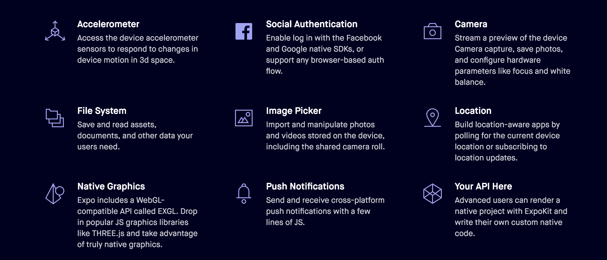
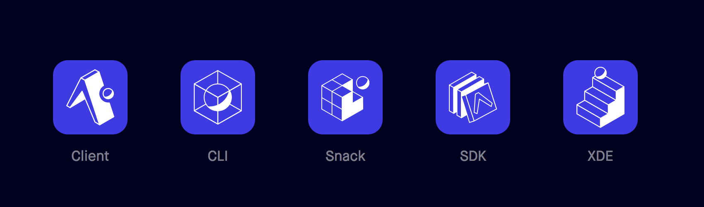
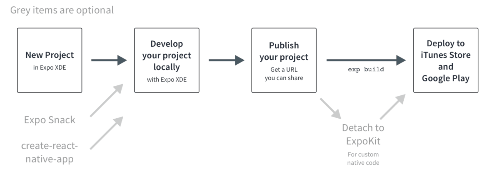
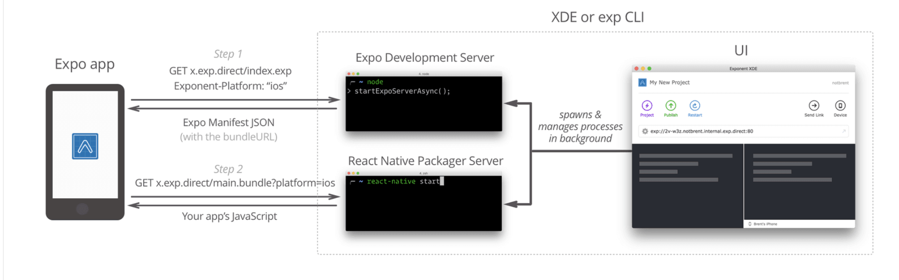
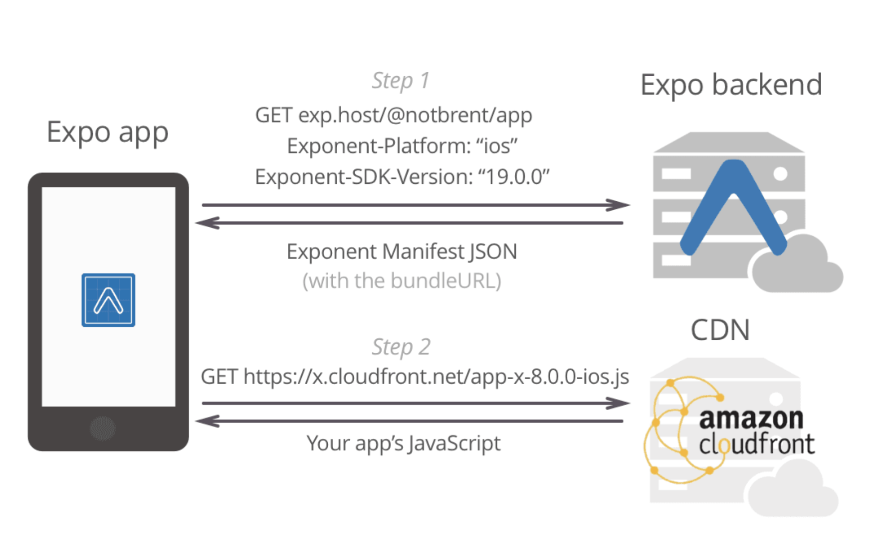

# React Native vs Expo.io
(deep inside)

---

# What is Expo?

+++

## A framework 

###### Expo is a free and complete workflow for creating next-generation apps for iOS and Android



+++

## Expo development tools 



---

# But wait we use expo in React Native application?

+++

## Yes for the client part


---

# Okay but React Nativ is for mobile application?

+++

## yes but limited to react-nativ components!

+++

#### you can eject a react nativ app to access managed code

```
$ npm run eject
$ git status
Changes not staged for commit:
  (use "git add <file>..." to update what will be committed)
  (use "git checkout -- <file>..." to discard changes in working directory)

	modified:   app.json

Untracked files:
  (use "git add <file>..." to include in what will be committed)

	android/
	ios/

```

+++

###### Do you really want / need to link library to access device hardware?

```
$ npm install <library-with-native-dependencies> --save
$ react-native link
```

---

# It's why Expo!

+++

## Exp and Expo is the same package?

##### No

* https://www.npmjs.com/package/expo
* https://www.npmjs.com/package/exp

+++

## Exp is The Expo Development CLI

```
$ exp start
...
[exp] Your URL is
 
exp://3h-xu5.jesse.expo-example.exp.direct
```

+++

## Expo is a fork of react-nativ

The Expo SDK provides access to system functionality such as contacts, camera, and location for Expo apps.

```
{
  "name": "crna",
  },
  "dependencies": {
    "react-native": "https://github.com/expo/react-native/archive/sdk-25.0.0.tar.gz",
  }
}
```


---

### Using exp server or XDE

#### Allow to manage workflow lifecycle 



+++ 

## Local expo development



+++

## Published version



---

# Pro tips

+++

# Debugging

#### Beware of CORS!!

#### Demo

+++

# Push notifications

### handle by Expo and easy with expo-server-sdk

+++

# Build and deploy to stores

### Demo

---

# THE END =)

