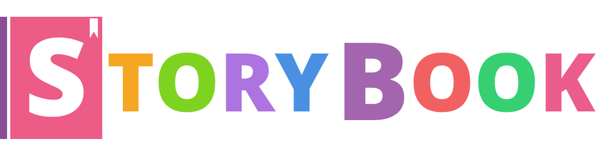

# Once Upon A Time



#HSLIDE
### What? How ? 
### Get! Easy :)


[npm i -g getstorybook](https://raw.githubusercontent.com/coorpacademy/tekacademy/storybook/assets/npmiStorybook.png)

```
cd my-repo
```

[getstorybook](https://raw.githubusercontent.com/coorpacademy/tekacademy/storybook/assets/getStorybook.png)

#VSLIDE

###Use

```
npm run storybook
```


#HSLIDE

### Looks good !

- Easy search
- Every component with every fixtures
- Automatic render
- Action logger

[STORYBOOK-DEMO](http://localhost:9009/)
[COORP-DEMO](http://localhost:3004/)

#VSLIDE

### What now ?

it's all about stories

1 story === 1 fixtures


#VSLIDE

### Writing a story

One by one

```
// file: src/stories/index.js

import React from 'react';
import { storiesOf, action } from '@kadira/storybook';
import Button from '../components/Button';

storiesOf('Button', module)
  .add('with text', () => (
    <Button onClick={action('clicked')}>Hello Button</Button>
  ))
  .add('with some emoji', () => (
    <Button onClick={action('clicked')}>😀 😎 👍 💯</Button>
  ));
```
#VSLIDE

### Writing a story

load all of them

```
import { configure } from '@kadira/storybook';

function loadStories() {
  require('../storybook');
}

configure(loadStories, module);

```
#HSLIDE

### TESTING

- Structure : StoryShots (jestSnapshots)
- Interaction (with Enzyme)
- CSS testing et manual testing

#HSLIDE

### CONFIGURATION

Babel, Webpack, css, ES2016

#HSLIDE

